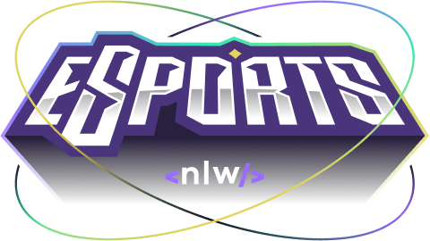

  

## Sobre o projeto
O Find Your Duo foi desenvolvido durante a semana NLW Esports promovido pela Rocketseat.

## ⚙️ Funcionalidades - WIP

<h4>
  ✔️ Publicar um anúncio  
  ✔️ Mostrar banner dos jogos e número de anúncios criados  
  ✔️ Versão mobile com React Native  
  ✔️ Backend  
</h4>

## ⚙️ Desafios Adicionais - WIP

<h4>
  ✔️ Carrousel com os jogos  
  ✔️ Responsivo  
  ✔️ Recriar o seletor de jogos utilizando RadixUI  
  ❌ Validação de formulário
</h4>

## 🛠 Tecnologias

<h4>
  React  
  TypeScript  
  Tailwind  
  RadixUI  
  Phosphoricons React  
  React Slick  
</h4>